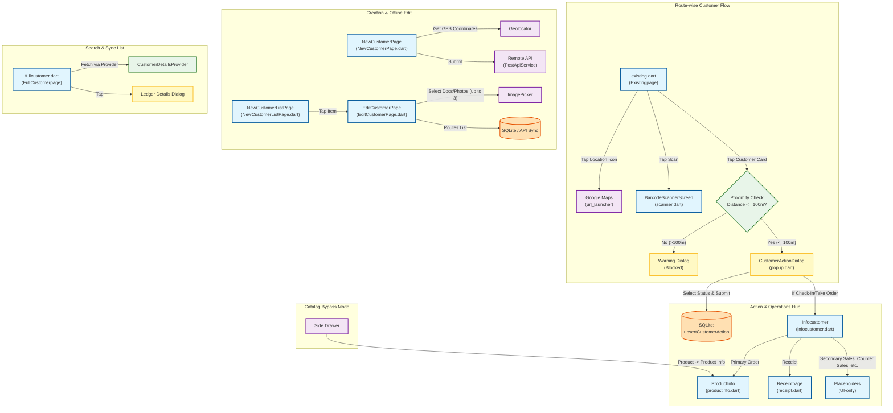

# Customer Module Documentation

This document describes the structure, components, and screen navigation flows of the Customer module in the Suitapps UI codebase.

> [!NOTE]
> The active customer codebase is located in [lib/features/customer/](file:///d:/sravan/suitapps/lib/features/customer/) (referred to as `lib/customer/` in legacy documentation references).

---

## 🏗 Module Architecture & Screen Flow

The customer module manages the lifecycle of customers, from showing existing customers nearby via GPS tracking to creating new customer profiles, checking in/performing actions, and recording transactions (such as orders and receipts).

---

## 📄 Detailed File Breakdown & Screen Access

### 1. [existing.dart](file:///d:/sravan/suitapps/lib/features/customer/existing_customers_page.dart) (`Existingpage`)
* **Purpose**: Displays list of existing route-wise customers and controls check-in accessibility using proximity restriction.
* **Key Features**:
  * **Proximity Checking**: Uses `Geolocator` to track user coordinates against the customer's coordinates. Taps are locked if the distance exceeds 100.0 meters (controlled by `MAX_ALLOWED_DISTANCE`).
  * **Category Sorting**: Dynamically groups customers into Nearby Customers (sorted nearest to farthest) and Customers with No Location Details (no coordinates registered).
  * **External Integration**: Tapping the location icon launches Google Maps via the `url_launcher` package.
* **Navigates / Accesses**:
  * `BarcodeScannerScreen` (via `scanner.dart`) to scan customer barcodes.
  * `CustomerActionDialog` (via `popup.dart`) when tapping a valid/nearby customer.

### 2. `popup.dart` (`CustomerActionDialog`)
* **Purpose**: An action popup showing customer report options.
* **Key Features**:
  * Allows selecting customer status check-boxes: Check-In (Take Order), No Order, Closed, or Other Reason (requires description text).
  * Saves the selected action to the local SQLite database using `DatabaseOperations.instance.upsertCustomerAction(data)`.
* **Navigates / Accesses**:
  * `Infocustomer` (via `infocustomer.dart`) when Take Order / Check-In is submitted.

### 3. `infocustomer.dart` (`Infocustomer`)
* **Purpose**: Customer Operations Hub containing a dashboard grid of actions.
* **Key Features**:
  * Displays general customer data (Account Name, Address, and Phone).
  * Provides a 4x3 dashboard grid interface.
* **Navigates / Accesses**:
  * **Primary Order**: Navigates to `ProductInfo` screen (via `productinfo.dart`) to record orders.
  * **Receipt**: Navigates to `Receiptpage` screen (via `receipt.dart`) to record payment collections.
  * **Placeholders** (UI-only currently): Secondary Sales, Counter Sales, Outlets, Projection, Van Sales, GRN, Stock Upload, Asset, Edit Customer, and History.

### 4. `NewCustomerPage.dart` (`NewCustomerPage`)
* **Purpose**: Form page to register a new customer profile.
* **Key Features**:
  * Captures user details like Name, Address, Route, Type, Rate Type (MRP, RS), Card Number, and email.
  * Records user's GPS coordinates using `Geolocator` when saving the new customer record.
* **Navigates / Accesses**:
  * Submits data to the backend server API using `PostApiService.insertCustomerToApi(data)`.

### 5. `EditCustomerPage.dart` (`EditCustomerPage`)
* **Purpose**: Form page to edit offline/new customer info.
* **Key Features**:
  * Lets user update route details, sale type, details, and upload up to 3 documents/photos using `ImagePicker`.
  * Pulls route listings dynamically from local SQLite or fetches and syncs them from remote API.

### 6. `NewCustomerListPage.dart` (`NewCustomerListPage`)
* **Purpose**: Simple list viewer for offline/newly added customers.
* **Navigates / Accesses**:
  * `EditCustomerPage` when a customer item is tapped.

### 7. `fullcustomer.dart` (`FullCustomerpage`)
* **Purpose**: Displays a searchable list of all synced/active customers from the backend.
* **Key Features**:
  * Pulls full client list via `CustomerDetailsProvider` using selected company context.
  * Shows a popup dialog with complete ledger details (State, Branch ID, GSTIN, Email, Shipping, etc.) when tapped.

### 8. `existing_popup.dart`
* **Status**: Commented Out. Contains a backup copy/draft of the code in `existing.dart`. Can be ignored in active application flows.

---

## 📍 Geofencing & Radius-Restricted Ordering Flow

To ensure validity and prevent off-site orders, the application restricts order submission using a geofencing check. A user can only initiate an order for a customer when they are physically within the customer's location radius:

### 1. The Proximity Check (`existing.dart`)
* When a user taps an existing customer's card, the application fetches the user's current GPS location.
* It calculates the distance between the user's GPS coordinates and the customer's coordinates.
* **Allowed Radius Limit**: 100.0 meters (defined as `MAX_ALLOWED_DISTANCE` in `existing.dart`).
* **Outside Proximity**: If the user is outside this 100m radius, they are blocked by a warning dialog displaying the message: `"You need to be within 100 meters to access customer report."` Tapping to order is disabled.
* **Within Proximity**: If they are within 100m, they are allowed to proceed to the customer actions popup.

### 2. Check-In & Placing Orders (`popup.dart` & `infocustomer.dart`)
* From the actions dialog, checking Check-In (Take Order) and submitting navigates the user to `Infocustomer`.
* From the Customer Info dashboard, clicking Primary Order opens `ProductInfo` with the customer details preloaded.

### 3. Drawer Catalog Mode (Bypass)
* Tapping **Product -> Product Info** in the side drawer navigates directly to `ProductInfo` with `navigationSource: 'drawer'` (with no customer selected, `widget.accountCode` is null). This is for viewing product catalog details only, and does not allow submitting a customer order.
